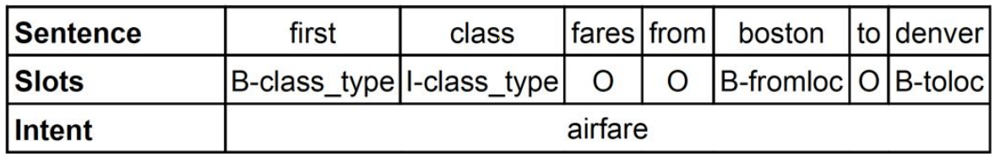
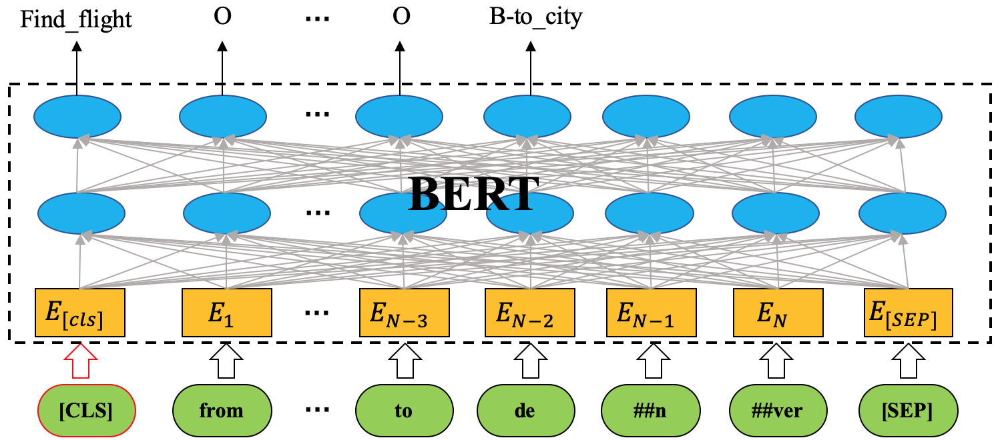
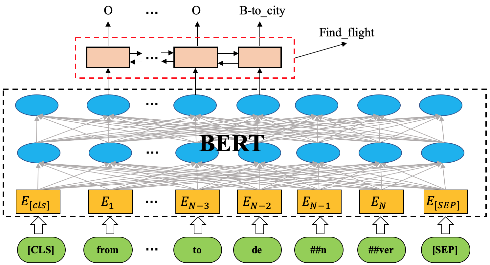

# Slot filling and intent detection tasks of spoken language understanding
 * Basic models for slot filling and intent detection:
   * An implementation for "focus" part of the paper "Encoder-decoder with focus-mechanism for sequence labelling based spoken language understanding" [(Su Zhu and Kai Yu, 2016)](https://arxiv.org/abs/1608.02097).
   * An implementation of BLSTM-CRF based on [jiesutd/NCRFpp](https://github.com/jiesutd/NCRFpp/blob/master/model/crf.py)
   * An implementation of joint training of slot filling and intent detection tasks [(Bing Liu and Ian Lane, 2016)](https://arxiv.org/abs/1609.01454).
 * Basic models + [ELMo](https://arxiv.org/abs/1802.05365) / [BERT](https://github.com/google-research/bert) / [XLNET](https://github.com/zihangdai/xlnet)
 * Tutorials on datasets:
   - [ATIS](https://github.com/yvchen/JointSLU)
   - [SNIPS](https://github.com/snipsco/nlu-benchmark/tree/master/2017-06-custom-intent-engines)
   - The [Facebook’s multilingual dataset](https://fb.me/multilingual_task_oriented_data) (English/Spanish/Thai)
   - [MIT_Restaurant_Movie_corpus](https://groups.csail.mit.edu/sls/downloads/) (w/o intent)
   - [E-commerce Shopping Assistant (ECSA) from Alibaba](https://github.com/pangolulu/DCMTL) (w/o intent, in Chinese)
   - [CoNLL-2003 NER](https://github.com/kamalkraj/BERT-NER/tree/dev/data) (w/o intent)
 
 

| Section | Description |
|-|-|
| [Setup](#setup) | Required packages |
| [Evaluation of intent detection for multiple intents](#about-the-evaluations-of-intent-detection-on-atis-and-snips-datasets) | How to report performance of intent detection on ATIS dataset |
| [Tutorials A: with pretrained word embeddings](#tutorials-a-slot-filling-and-intent-detection-with-pretrained-word-embeddings) | Tutorials A: Slot filling and intent detection with pretrained word embeddings |
| [Tutorials B: with ELMo](#tutorials-b-slot-filling-and-intent-detection-with-elmo) | Tutorials B: Slot filling and intent detection with ELMo |
| [Tutorials C: with BERT](#tutorials-c-slot-filling-and-intent-detection-with-bert) | Tutorials C: Slot filling and intent detection with BERT |
| [Tutorials D: with XLNET](#tutorials-d-slot-filling-and-intent-detection-with-xlnet) | Tutorials D: Slot filling and intent detection with XLNET |
| [Results](#results) | Results of different methods on certain datasets |
| [Inference Mode](#inference-mode) | Inference Mode |
| [Reference](#reference) | How to cite? |

## Setup
 * python 3.6.x
 * [pytorch](https://pytorch.org/) 1.4.0
 * pip install gpustat     [if gpu is used]
 * [embeddings](https://github.com/vzhong/embeddings): pip install embeddings
 * [ELMo in allennlp](https://github.com/allenai/allennlp): pip install allennlp
 * [BERT/XLNET in transformers](https://github.com/huggingface/transformers): pip install transformers (2.5.0)
 
## About the evaluations of intent detection on ATIS and SNIPS datasets

As we can know from the datasets, ATIS may have multiple intents for one utterance while SNIPS has only one intent for one utterance. For example, "show me all flights and fares from denver to san francisco <=> atis_flight && atis_airfare". Therefore, there is a public trick in the training and evaluation stages for intent detection of ATIS dataset.

**NOTE!!!**: Impacted by the paper ["What is left to be understood in ATIS?"](https://ieeexplore.ieee.org/abstract/document/5700816), almost all works about ATIS choose the first intent as the label to train a "softmax" intent classifier. In the evaluation stage, it will be viewed as correct if the predicted intent is one of the multiple intents.

## TODO: 
 * Add char-embeddings

## Tutorials A: Slot filling and intent detection with pretrained word embeddings
 1. Pretrained word embeddings are borrowed from CNN-BLSTM language models of [ELMo](https://github.com/allenai/allennlp/blob/master/tutorials/how_to/elmo.md) where word embeddings are modelled by char-CNNs. We extract the pretrained word embeddings for [ATIS](https://github.com/yvchen/JointSLU), [SNIPS](https://github.com/snipsco/nlu-benchmark/tree/master/2017-06-custom-intent-engines), [the Facebook’s multilingual dataset](https://fb.me/multilingual_task_oriented_data) and [MIT_Restaurant_Movie_corpus](https://groups.csail.mit.edu/sls/downloads/)(w/o intent) datasets by:
 ```sh
   python3 scripts/get_ELMo_word_embedding_for_a_dataset.py \
           --in_files data/atis-2/{train,valid,test} \
           --output_word2vec local/word_embeddings/elmo_1024_cased_for_atis.txt
   python3 scripts/get_ELMo_word_embedding_for_a_dataset.py \
           --in_files data/snips/{train,valid,test} \
           --output_word2vec local/word_embeddings/elmo_1024_cased_for_snips.txt
   python3 scripts/get_ELMo_word_embedding_for_a_dataset.py \
           --in_files data/MIT_corpus/{movie_eng,movie_trivia10k13,restaurant}/{train,valid,test} \
           --output_word2vec local/word_embeddings/elmo_1024_cased_for_MIT_corpus.txt
```
, or use Glove and KazumaChar [embeddings](https://github.com/vzhong/embeddings) which are also exploited in the [TRADE](https://arxiv.org/pdf/1905.08743.pdf) dialogue state tracker:
 ```sh
   python3 scripts/get_Glove-KazumaChar_word_embedding_for_a_dataset.py \
           --in_files data/atis-2/{train,valid,test} \
           --output_word2vec local/word_embeddings/glove-kazumachar_400_cased_for_atis.txt
   python3 scripts/get_Glove-KazumaChar_word_embedding_for_a_dataset.py \
           --in_files data/snips/{train,valid,test} \
           --output_word2vec local/word_embeddings/glove-kazumachar_400_cased_for_snips.txt
   python3 scripts/get_Glove-KazumaChar_word_embedding_for_a_dataset.py \
           --in_files data/multilingual_task_oriented_data/en/{train,valid,test} \
           --output_word2vec local/word_embeddings/glove-kazumachar_400_cased_for_multilingual_en.txt
   python3 scripts/get_Glove-KazumaChar_word_embedding_for_a_dataset.py \
           --in_files data/MIT_corpus/{movie_eng,movie_trivia10k13,restaurant}/{train,valid,test} \
           --output_word2vec local/word_embeddings/glove-kazumachar_400_cased_for_MIT_corpus.txt
```
, or use word embeddings in the pretrained BERT model:
```sh
  python3 scripts/get_BERT_word_embedding_for_a_dataset.py \
          --in_files data/multilingual_task_oriented_data/es/{train,valid,test} \
          --output_word2vec local/word_embeddings/bert_768_cased_for_multilingual_es.txt \
          --pretrained_tf_type bert --pretrained_tf_name bert-base-multilingual-cased
  python3 scripts/get_BERT_word_embedding_for_a_dataset.py \
          --in_files data/multilingual_task_oriented_data/es/{train,valid,test} \
          --output_word2vec local/word_embeddings/bert_768_cased_for_multilingual_es.txt \
          --pretrained_tf_type bert --pretrained_tf_name bert-base-multilingual-cased
```

 2. Run scripts of training and evaluation at each epoch.
   * BLSTM model (*slot_tagger*)
   * BLSTM-CRF model (*slot_tagger_with_crf*)
   * Enc-dec focus model (BLSTM-LSTM) (*slot_tagger_with_focus*), the same as Encoder-Decoder NN (with aligned inputs)(Liu and Lane, 2016)
   ```sh
   slot_intent_model=slot_tagger # slot_tagger, slot_tagger_with_crf, slot_tagger_with_focus
   bash run/atis_with_pretrained_word_embeddings.sh --task_slot_filling ${slot_intent_model}
   bash run/snips_with_pretrained_word_embeddings.sh --task_slot_filling ${slot_intent_model}
   bash run/MIT_corpus_with_pretrained_word_embeddings.sh --task_slot_filling ${slot_intent_model} --dataroot data/MIT_corpus/movie_eng --dataset mit_movie_eng
   bash run/multilingual_en_with_pretrained_word_embeddings.sh --task_slot_filling ${slot_intent_model}
   bash run/multilingual_es_with_pretrained_word_embeddings.sh --task_slot_filling ${slot_intent_model}
   bash run/multilingual_th_with_pretrained_word_embeddings.sh --task_slot_filling ${slot_intent_model}
   ```

## Tutorials B: Slot filling and intent detection with [ELMo](https://arxiv.org/abs/1802.05365)
 
 1. Run scripts of training and evaluation at each epoch.
   * ELMo + BLSTM/BLSTM-CRF/Enc-dec focus model (BLSTM-LSTM) models:  
   ```sh
   slot_intent_model=slot_tagger # slot_tagger, slot_tagger_with_crf, slot_tagger_with_focus
   bash run/atis_with_elmo.sh --task_slot_filling ${slot_intent_model}
   bash run/snips_with_elmo.sh --task_slot_filling  ${slot_intent_model}
   bash run/MIT_corpus_with_elmo.sh --task_slot_filling  ${slot_intent_model} --dataroot data/MIT_corpus/movie_eng --dataset mit_movie_eng
   ```

## Tutorials C: Slot filling and intent detection with [BERT](https://github.com/google-research/bert)
 
 0. Model architectures:
   
   * [Joint BERT](https://arxiv.org/pdf/1902.10909.pdf) or "with **pure BERT**":
   
   
   
   * Our BERT + BLSTM (BLSTM-CRF\Enc-dec focus):
   
   

 1. Run scripts of training and evaluation at each epoch.
   * Pure BERT (without or with crf) model: 
   ```sh
   slot_model=NN # NN, NN_crf
   intent_input=CLS # none, CLS, max, CLS_max
   bash run/atis_with_pure_bert.sh --task_slot_filling ${slot_model} --task_intent_detection ${intent_input}
   bash run/snips_with_pure_bert.sh --task_slot_filling ${slot_model} --task_intent_detection ${intent_input}
   bash run/MIT_corpus_with_pure_bert.sh --task_slot_filling ${slot_model} --task_intent_detection ${intent_input} --dataroot data/MIT_corpus/movie_eng --dataset mit_movie_eng
   bash run/multilingual_en_with_pure_bert.sh --task_slot_filling ${slot_model} --task_intent_detection ${intent_input}
   bash run/multilingual_es_with_pure_bert.sh --task_slot_filling ${slot_model} --task_intent_detection ${intent_input}
   bash run/multilingual_th_with_pure_bert.sh --task_slot_filling ${slot_model} --task_intent_detection ${intent_input}
   bash run/ECSA_with_pure_bert.sh --task_slot_filling ${slot_model} --task_intent_detection ${intent_input}
   bash run/CoNLL2003_NER_with_pure_bert.sh --task_slot_filling ${slot_model} --task_intent_detection ${intent_input}
   ```
   * BERT + BLSTM/BLSTM-CRF/Enc-dec focus model (BLSTM-LSTM) models: 
   ```sh
   slot_intent_model=slot_tagger # slot_tagger, slot_tagger_with_crf, slot_tagger_with_focus
   bash run/atis_with_bert.sh --task_slot_filling ${slot_intent_model}
   bash run/snips_with_bert.sh --task_slot_filling ${slot_intent_model}
   bash run/MIT_corpus_with_bert.sh --task_slot_filling ${slot_intent_model} --dataroot data/MIT_corpus/movie_eng --dataset mit_movie_eng
   ```

 2. For optimizer, you can try **BertAdam** and **AdamW**. In my experiments, I choose to use BertAdam.

## Tutorials D: Slot filling and intent detection with [XLNET](https://github.com/zihangdai/xlnet)

 1. Run scripts of training and evaluation at each epoch.
   * Pure XLNET (without or with crf) model: 
   ```sh
   slot_model=NN # NN, NN_crf
   intent_input=CLS # none, CLS, max, CLS_max
   bash run/atis_with_pure_xlnet.sh --task_slot_filling ${slot_model} --task_intent_detection ${intent_input}
   bash run/snips_with_pure_xlnet.sh --task_slot_filling ${slot_model} --task_intent_detection ${intent_input}
   bash run/MIT_corpus_with_pure_xlnet.sh --task_slot_filling ${slot_model} --task_intent_detection ${intent_input} --dataroot data/MIT_corpus/movie_eng --dataset mit_movie_eng
   ```
   * XLNET + BLSTM/BLSTM-CRF/Enc-dec focus model (BLSTM-LSTM) models: 
   ```sh
   slot_intent_model=slot_tagger # slot_tagger, slot_tagger_with_crf, slot_tagger_with_focus
   bash run/atis_with_xlnet.sh --task_slot_filling ${slot_intent_model}
   bash run/snips_with_xlnet.sh --task_slot_filling ${slot_intent_model}
   bash run/MIT_corpus_with_xlnet.sh --task_slot_filling ${slot_intent_model} --dataroot data/MIT_corpus/movie_eng --dataset mit_movie_eng
   ```

 2. For optimizer, you can try BertAdam and AdamW.


## Results:

 * For "NLU + BERT/XLNET" models, hyper-parameters are not tuned carefully.
 
 1. Results of ATIS:
    
    | models | intent Acc (%) | slot F1-score (%) |
    |:------:|------|-------|
    | [Atten. enc-dec NN with aligned inputs](Liu and Lane, 2016) | 98.43 | 95.87 |
    | [Atten.-BiRNN](Liu and Lane, 2016) | 98.21 | 95.98 |
    | [Enc-dec focus](Zhu and Yu, 2017) | - | 95.79 |
    | [Slot-Gated](Goo et al., 2018) | 94.1 | 95.2 |
    | [Intent Gating & self-attention](https://www.aclweb.org/anthology/D18-1417) | 98.77 | **96.52** |
    | [BLSTM-CRF + ELMo](https://arxiv.org/abs/1811.05370) | 97.42 | 95.62 |
    | [Joint BERT](https://arxiv.org/pdf/1902.10909.pdf) | 97.5 | 96.1 |
    | [Joint BERT + CRF](https://arxiv.org/pdf/1902.10909.pdf) | 97.9 | 96.0 |
    | BLSTM (A. Pre-train word emb. of ELMo) | 98.10 | 95.67 |
    | BLSTM-CRF (A. Pre-train word emb. of ELMo) | 98.54 | 95.39 |
    | Enc-dec focus (A. Pre-train word emb. of ELMo) | 98.43 | 95.78 |
    | BLSTM (A. Pre-train word emb. of Glove & KazumaChar) | 98.66 | 95.55 |
    | BLSTM-CRF (A. Pre-train word emb. of Glove & KazumaChar) | 98.21 | 95.74 |
    | Enc-dec focus (A. Pre-train word emb. of Glove & KazumaChar) | 98.66 | 95.86 |
    | BLSTM (B. +ELMo) | 98.66 | 95.52 |
    | BLSTM-CRF (B. +ELMo) | 98.32 | 95.62 |
    | Enc-dec focus (B. +ELMo) | 98.66 | 95.70 |
    | BLSTM (C. +BERT) | **99.10** | 95.94 | (hidden_size=100, dropout=0.5, lr=1e-4)
    | BLSTM (D. +XLNET) | 98.77 | 96.08 |
 
 2. Results of SNIPS:
   
  * Cased BERT-base model gives better result than uncased model.
    
    | models | intent Acc (%) | slot F1-score (%) |
    |:------:|------|-------|
    | [Slot-Gated](Goo et al., 2018) | 97.0 | 88.8 |
    | [BLSTM-CRF + ELMo](https://arxiv.org/abs/1811.05370) | **99.29** | 93.90 |
    | [Joint BERT](https://arxiv.org/pdf/1902.10909.pdf) | 98.6 | 97.0 |
    | [Joint BERT + CRF](https://arxiv.org/pdf/1902.10909.pdf) | 98.4 | 96.7 |
    | BLSTM (A. Pre-train word emb. of ELMo) | 99.14 | 95.75 |
    | BLSTM-CRF (A. Pre-train word emb. of ELMo) | 99.00 | 96.92 |
    | Enc-dec focus (A. Pre-train word emb. of ELMo) | 98.71 | 96.22 |
    | BLSTM (A. Pre-train word emb. of Glove & KazumaChar) | 99.14 | 96.24 |
    | BLSTM-CRF (A. Pre-train word emb. of Glove & KazumaChar) | 98.86 | 96.31 |
    | Enc-dec focus (A. Pre-train word emb. of Glove & KazumaChar) | 98.43 | 96.06 |
    | BLSTM (B. +ELMo) | 98.71 | 96.32 |
    | BLSTM-CRF (B. +ELMo) | 98.57 | 96.61 |
    | Enc-dec focus (B. +ELMo) | 99.14 | 96.69 |
    | BLSTM (C. +BERT) | 98.86 | 96.92 |
    | BLSTM-CRF (C. +BERT) | 98.86 | 97.00 | 
    | Enc-dec focus (C. +BERT) | 98.71 | **97.17** | 
    | BLSTM (D. +XLNET) | 98.86 | 97.05 |
 
 3. Results of [the Facebook’s multilingual dataset](https://fb.me/multilingual_task_oriented_data) (note: cased BERT-base model gives better result than uncased model):
    - English (en):
    
    | models | intent Acc (%) | slot F1-score (%) |
    |:------:|------|-------|
    | [Cross-Lingual Transfer](https://arxiv.org/pdf/1810.13327.pdf) (only target) | 99.11 | 94.81 |
    | BLSTM (no Pre-train word emb.) | 99.19 | 95.37 |
    | Enc-dec focus (A. Pre-train word emb. of Glove & KazumaChar) | 99.28 | 96.04 |
    | Pure BERT | **99.34** | **96.23** |
    
    - Spanish (es):
    
    | models | intent Acc (%) | slot F1-score (%) |
    |:------:|------|-------|
    | [Cross-Lingual Transfer](https://arxiv.org/pdf/1810.13327.pdf) (only target) | 97.26 | 80.95 |
    | [Cross-Lingual Transfer](https://arxiv.org/pdf/1810.13327.pdf) (Cross-lingual + ELMo) | 97.51 | 83.38 |
    | BLSTM (no Pre-train word emb.) (only target) | 97.63 | 86.05 |
    | Enc-dec focus (A. Pre-train word emb. of BERT input layer) (only target) | 97.67 | 88.67 |
    | Pure BERT (only target) | **98.85** | **89.26** |
    
    - Thai (th): (it seems "Enc-dec focus" gives better results than BLSTM)
    
    | models | intent Acc (%) | slot F1-score (%) |
    |:------:|------|-------|
    | [Cross-Lingual Transfer](https://arxiv.org/pdf/1810.13327.pdf) (only target) | 95.13 | 87.26 |
    | [Cross-Lingual Transfer](https://arxiv.org/pdf/1810.13327.pdf) (Cross-lingual + Mult. CoVe + auto) | 96.87 | 91.51 |
    | BLSTM (no Pre-train word emb.) (only target) | 96.99 | 89.17 |
    | Enc-dec focus (no Pre-train word emb.) (only target) | 96.75 | 91.31 |
    | Enc-dec focus (A. Pre-train word emb. of BERT input layer) (only target) | 96.87 | 91.05 |
    | Pure BERT (only target) | **97.34** | **92.51** |
    
 
 4. Slot F1-scores of [MIT_Restaurant_Movie_corpus](https://groups.csail.mit.edu/sls/downloads/)(w/o intent):
    
    | models | Restaurant | Movie_eng | Movie_trivia10k13 |
    |:------:|------|-------|-------|
    | [Dom-Gen-Adv](https://arxiv.org/pdf/1711.11310.pdf) | 74.25 | 83.03 | 63.51 |
    | [Joint Dom Spec & Gen-Adv](https://arxiv.org/pdf/1711.11310.pdf) | 74.47 | 85.33 | 65.33 |
    | [Data Augmentation via Joint Variational Generation](https://arxiv.org/pdf/1809.02305.pdf) | 73.0 | 82.9 | 65.7 |
    | BLSTM (A. Pre-train word emb. of ELMo) | 77.54 | 85.37 | 67.97 |
    | BLSTM-CRF (A. Pre-train word emb. of ELMo) | 79.77 | 87.36 | 71.83 |
    | Enc-dec focus (A. Pre-train word emb. of ELMo) | 78.77 | 86.68 | 70.85 |
    | BLSTM (A. Pre-train word emb. of Glove & KazumaChar) | 78.02 | 86.33 | 68.55 |
    | BLSTM-CRF (A. Pre-train word emb. of Glove & KazumaChar) | 79.84 | **87.61** | **71.90** |
    | Enc-dec focus (A. Pre-train word emb. of Glove & KazumaChar) | **79.98** | 86.82 | 71.10 |

 5. Slot F1-scores of [E-commerce Shopping Assistant (ECSA) from Alibaba](https://github.com/pangolulu/DCMTL)(w/o intent, in Chinese):
    
    | models | slot F1-score (%) |
    |:------:|------|
    | [Basic BiLSTM-CRF](https://arxiv.org/pdf/1803.11326.pdf) | 43.02 |
    | Pure BERT | 46.96 |
    | Pure BERT-CRF | 47.75 |

 6. Entity F1-scores of [CoNLL-2003 NER](https://github.com/kamalkraj/BERT-NER/tree/dev/data)(w/o intent):
    
    | models | F1-score (%) |
    |:------:|------|
    | Pure BERT | 91.36 |
    | Pure BERT-CRF | 91.55 |

## Inference Mode
An example here:
```
bash run/atis_with_pretrained_word_embeddings_for_inference_mode__an_example.sh
```

## Reference
 * Su Zhu and Kai Yu, "Encoder-decoder with focus-mechanism for sequence labelling based spoken language understanding," in IEEE International Conference on Acoustics, Speech and Signal Processing(ICASSP), 2017, pp. 5675-5679.
